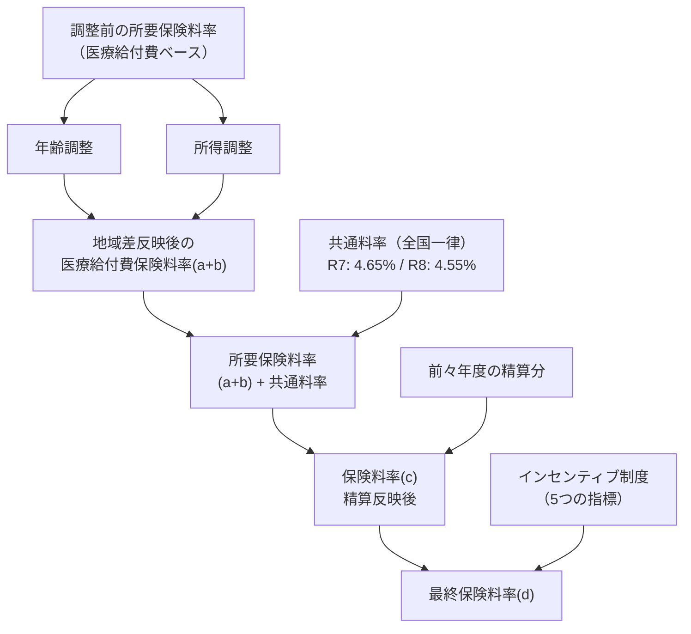

# 保険料率予測モデル：分析手法の比較と評価指標のガイド

## 1. PDFから読み取った保険料率の算定構造

2つのPDF（令和7年度・令和8年度）から、都道府県単位保険料率は以下のように算定されています。

### 算定式

```
最終保険料率 = 地域差反映保険料率 + 共通料率 + 精算分 + インセンティブ分
```

具体的には：



### 共通料率の内訳（全国一律）

| 項目 | R7年度 | R8年度 |
|------|------:|------:|
| 傷病手当金等（現金給付費） | 0.51% | 0.52% |
| 前期高齢者納付金等 | 3.38% | 3.25% |
| 保健事業費等 | 0.78% | 0.83% |
| その他収入 | ▲0.03% | ▲0.04% |
| **合計** | **4.65%** | **4.55%** |

### 保険料率の構成要素一覧

| # | 構成要素 | 性質 | データの入手性 |
|---|---------|------|-------------|
| 1 | **医療給付費（調整前所要保険料率）** | 都道府県ごとに異なる | 公開データあり |
| 2 | **年齢調整** | 年齢構成の差を補正 | 算出可能 |
| 3 | **所得調整** | 所得水準の差を補正 | 算出可能 |
| 4 | **共通料率** | 全国一律 | PDF記載 |
| 5 | **前々年度精算分** | 都道府県ごとに異なる | PDF表から読取可 |
| 6 | **インセンティブ分** | 5つの指標から算出 | 既存データ |

> [!IMPORTANT]
> **5つの指標（インセンティブ制度）は保険料率全体のうち、±0.01%～0.16%程度の影響しか持ちません。**
> 保険料率の大部分は「医療給付費の地域差」「年齢構成」「所得水準」で決定されています。
> これが前回の重回帰分析でR²=0.16しか出なかった根本的な理由です。

---

## 2. 予測に必要な追加データ（説明変数候補）

PDFの算定構造から、以下のデータを追加すれば予測精度が大幅に向上すると考えられます。

### 必須レベル（影響大）

| 変数 | 説明 | データ源 |
|------|------|---------|
| **1人当たり医療給付費** | 保険料率の最大の決定要因 | 協会けんぽ事業年報 |
| **平均年齢** or **年齢構成割合** | 年齢調整の基礎データ | 総務省統計 |
| **1人当たり平均報酬額** | 所得調整の基礎データ | 協会けんぽ事業年報 |
| **前期高齢者比率** | 納付金に影響 | 後期高齢者医療制度資料 |

### 推奨レベル（影響中）

| 変数 | 説明 | データ源 |
|------|------|---------|
| **前々年度収支差** | 精算分の基礎 | 協会けんぽ決算 |
| **被保険者数** | 規模効果 | 協会けんぽ事業年報 |
| **平均標準報酬月額** | 所得水準の代替指標 | 協会けんぽ事業年報 |
| **入院外医療費** / **入院医療費** | 医療費構成の違い | 厚労省統計 |

### 参考レベル（影響小〜中）

| 変数 | 説明 |
|------|------|
| 病床数（人口あたり） | 医療供給側の要因 |
| 高齢化率（65歳以上割合） | 年齢構成のシンプルな代替 |
| 1人あたり県民所得 | 所得水準の代替 |

---

## 3. 分析手法の候補

| 手法 | 特徴 | 強み | 弱み |
|------|------|------|------|
| **重回帰分析（OLS）** | 線形モデル | 解釈性が高い、係数の意味が明確 | 非線形関係を捉えられない |
| **Ridge/Lasso回帰** | 正則化付き線形モデル | 多重共線性に強い、変数選択 | 線形の制約は同じ |
| **ElasticNet** | Ridge+Lassoの組合せ | バランスの良い正則化 | ハイパーパラメータが増える |
| **ランダムフォレスト** | アンサンブル決定木 | 非線形対応、過学習しにくい | 解釈がやや困難 |
| **XGBoost** | 勾配ブースティング | 高精度、欠損値に強い | 過学習のリスク、チューニング必要 |
| **LightGBM** | 高速ブースティング | XGBoostより高速、大規模対応 | 少量データでは過学習リスク |
| **SVR（サポートベクター回帰）** | カーネル法 | 非線形対応、汎化性能 | スケーリング必要、解釈困難 |

---

## 4. モデル評価指標（★本題★）

### 4-1. 精度指標

| 指標 | 数式概要 | 意味 | 推奨度 |
|------|---------|------|:------:|
| **RMSE**（二乗平均平方根誤差） | √(Σ(y-ŷ)²/n) | 予測誤差の標準偏差。外れ値に敏感 | ★★★ |
| **MAE**（平均絶対誤差） | Σ\|y-ŷ\|/n | 予測誤差の平均。直感的 | ★★★ |
| **R²**（決定係数） | 1 - SS_res/SS_tot | 説明力の割合。0〜1 | ★★★ |
| **MAPE**（平均絶対パーセント誤差） | Σ\|y-ŷ\|/y × 100 / n | パーセントでの誤差。実務的 | ★★☆ |
| **調整済みR²** | 変数数で補正したR² | モデルの複雑さを考慮 | ★★☆ |

### 4-2. 交差検証で使うべき手法

データが235件（47都道府県×5年度）と**少量**なので、交差検証が非常に重要です。

| 手法 | 説明 | 本データへの適合性 |
|------|------|:---:|
| **K-Fold CV（k=5 or 10）** | データをk分割し、各分割で検証 | ◎ |
| **Leave-One-Out CV** | 1件ずつ抜いて検証。少量データ向き | ○ |
| **GroupKFold（都道府県グループ）** | 同一都道府県が訓練・テストに混ざらない | ◎◎（最推奨） |
| **TimeSeriesSplit** | 時系列を考慮した分割 | ○ |

> [!WARNING]
> **GroupKFoldを強く推奨します。** 通常のK-Foldでは「北海道の年度2,3,4を学習→年度5を予測」ではなく、「北海道の年度2が訓練データに入り、北海道の年度3が検証データに入る」というデータ漏洩が起こり得ます。都道府県ごとにグループ化することで、真の汎化性能を測定できます。

### 4-3. 推奨する評価フレームワーク

```
1. 各モデルに対して GroupKFold（グループ=都道府県） で交差検証
2. 以下の指標を全モデルで計算:
   - RMSE（主要評価指標）
   - MAE（補助指標）
   - R²（説明力）
   - MAPE（実務的解釈用）
3. ベストモデルの選定基準:
   → RMSEが最小のモデル（同等ならMAEも参照）
4. 最終チェック:
   → 学習データのRMSE vs テストデータのRMSE の差で過学習を確認
```

### 4-4. 本データ特有の注意点

| ポイント | 説明 |
|---------|------|
| **データ数が少ない（235件）** | XGBoost等の複雑なモデルは過学習しやすい。正則化・早期停止が必須 |
| **パネルデータ構造** | 同一都道府県の時系列データ → GroupKFoldで対策 |
| **目的変数の範囲が狭い** | 保険料率は9.2%〜11.0%に集中 → MAPEよりRMSEが適切 |
| **変数の追加で精度は大きく変わる** | モデルの種類よりも**特徴量エンジニアリング**が重要 |

---

## 5. 具体的な進め方の提案


> [!TIP]
> **最も精度向上に寄与するのは「モデルの種類を変えること」ではなく「説明変数を追加すること」です。**
> 特に「1人当たり医療給付費」と「平均報酬額」を加えるだけで、R²は0.16→0.7以上に大幅改善が期待できます。

---

## 6. まとめ

| 質問 | 回答 |
|------|------|
| どの評価指標？ | **RMSE**を主指標、MAE・R²を補助指標 |
| どの交差検証？ | **GroupKFold**（都道府県をグループ単位） |
| 何が最も重要？ | モデルの種類より**説明変数の追加**（医療給付費、年齢構成、所得水準） |
| 過学習の確認は？ | 学習RMSE vs テストRMSEの差を確認 |
