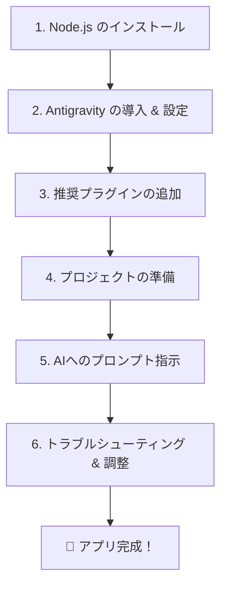

# 協会けんぽ削減シミュレーター アプリ作成マニュアル

本プロジェクトでは、**Node.js** 環境上で **TypeScript** と **React** を使用し、保険料削減シミュレーションを行うWebアプリケーションを構築する。
開発には自律型AIプログラミング環境である **Antigravity** を使用し、AIと対話しながらアプリケーションの設計・実装・修正を自動で行う。

---

## 🗺️ 全体の流れ



---

## 1. インストールが必要なアプリケーション

### 🟢 Node.js
JavaScriptをサーバーやローカルPC上で実行するための実行環境。本アプリのビルドやパッケージ管理に使用する。

* **ダウンロード & インストール**:  
  [Node.js 公式サイト](https://nodejs.org/ja/download) から「Windows インストーラー (.msi)」をダウンロードし、インストールする。

---

### 🚀 Antigravity
Google Gemini 3を搭載した、AIエージェントによる次世代の自律型プログラミング環境（IDE）。人間が自然言語（日本語）で指示を出すだけで、AIがターミナル操作、ファイル作成、ブラウザテストなどを自動で行い、アプリを構築する。VS Codeをベースにしているため、VS Codeの拡張機能もそのまま利用可能。

#### ① ダウンロード & 初期設定
詳細な設定手順については、以下の解説記事を参考にする。
* [Antigravityの始め方・使い方解説（note）](https://note.com/yamatoro2021/n/nb8afddf52497)

> [!IMPORTANT]
> **`GEMINI.md` の設定について**
> AIエージェントの基本動作を制御する `GEMINI.md` の内容は極めて重要である。安定した動作と指示の最適化のために、必ず以下の解説記事を参考に編集を行うこと。
> * [GEMINI.mdの重要設定と書き方（note）](https://note.com/kino_11/n/n825b9f9e9dc1)

---

## 2. おすすめプラグイン（拡張機能）

開発をより効率的に進めるために、以下の拡張機能をインストールすることを推奨する。
いずれも、キーボードの `Ctrl + Shift + X` を押して拡張機能マーケットプレイスを開き、検索窓からインストール可能。

### 🌐 Japanese Language Pack for Visual Studio Code
* **検索ワード**: `Japanese Language Pack for Visual Studio Code`
* **主な機能**:  
  Antigravity（VS Codeベース）のメニューやインターフェースを完全に日本語化する。最初にインストールしておくことで、操作が非常に分かりやすくなる。

### 📄 vscode-pdf
* **検索ワード**: `vscode-pdf`
* **主な機能**:  
  仕様書などのPDFファイルをエディタの画面右側に直接プレビュー表示できる。資料を確認しながらの開発が非常にスムーズになる。

### ✍️ Markdown Live Editor
* **検索ワード**: `Markdown Live Editor`  
  *(※検索結果から「拡張機能のフィルター」をクリックし、並べ替えを「評価」にすると上位に表示される)*
* **主な機能**:  
  * テキストを選択するだけで、太字、斜体、打ち消し線、リンクなどの修飾ボタンを表示。
  * リンクにカーソルを合わせるだけで、URLをプレビューし編集・削除が可能。
  * 行頭で `/` を入力することで、見出し、リスト、表、コードブロック、Mermaid図などをクイック挿入できる。

### 📊 Antigravity Quota (AGQ)
* **検索ワード**: `agq`
* **主な機能**:  
  画面の右下に表示される「AGQ」をクリックすることで、現在のAIモデルの使用量や、利用制限の更新時間（リセット時間）をいつでも確認できる。

---

## 3. KenpoSimulator アプリの作成手順

### Step 1: プロジェクトフォルダの準備
1. [SharePointの配布フォルダ](https://msccnagasakiuac.sharepoint.com/sites/0281b70b1817126d45fc5e95ede8ae48/Shared%20Documents/Forms/AllItems.aspx?id=%2Fsites%2F0281b70b1817126d45fc5e95ede8ae48%2FShared%20Documents%2F05%5F%E3%83%87%E3%83%BC%E3%82%BF%E5%88%86%E6%9E%90%E3%81%A7%E6%8C%91%E6%88%A6%EF%BC%81%E3%80%8C%E9%95%B7%E5%B4%8E%E7%9C%8C%E6%B0%91%E3%81%AE%E6%89%8B%E5%8F%96%E3%82%8A%E3%82%92%E5%A2%97%E3%82%84%E3%81%99%E3%80%8D%E5%81%A5%E5%BA%B7%E3%83%97%E3%83%AD%E3%82%B8%E3%82%A7%E3%82%AF%E3%83%88&viewid=6d294783%2Df99a%2D4b89%2Da7b1%2D7eb5a5c3eafc) から `KenpoSimulator` フォルダを丸ごとダウンロードする。
2. Antigravityを起動し、「フォルダーを開く」からダウンロードした `KenpoSimulator` を読み込む。

### Step 2: AIモデルの選択
画面上部のモデル選択にて **Gemini 3 Flash** などを選択する。（高度な推論にはOpusも使用可能だが、本アプリケーション規模であればFlashでも十分に素早く構築可能）。

### Step 3: プロンプト（開発指示）の入力
AI（Antigravity）へのチャット入力欄に、以下のプロンプト（指示文）をコピー＆ペーストして送信する。

```text
協会けんぽ保険料削減シミュレーション.pdfにあるシミュレーションを行うためのアプリを作成する。

条件は以下の通り：
- 単一のHTMLファイルで動作するWEBアプリ
- node.jsのプロジェクトとして構築
- 言語はTypeScript、フレームワークとしてReactを使用
- 表示画面は大きく3つのブロックに分かれる

1. 左上のブロック
   - 対象年度切り替えドロップダウンリスト（2022, 2023, 2024）
   - 47都道府県選択ドロップダウンリスト
   - 選択した都道府県の保険料率
   - アプリ利用者が支払っている保険料（入力フィールド）
   - シミュレーション後の保険料率
   - シミュレーション後の支払い保険料

2. 右上のブロック
   インセンティブ制度に基づく5つの指標に従い、ブロック内に5つの小ブロックを横並びに配置する。
   小ブロックの内容は以下の通り：
   - 指標名（特定健診等の実施率、特定保健指導の実施率、特定保健指導対象者の減少率、医療機関への受診勧奨基準において速やかに受診を要する者の医療機関受診率、ジェネリック医薬品の使用割合）
   - 選択都道府県における対象年度の各指標の数値（％）
   - 縦型ボリュームスライダー（上限・下限は選択年度の各指標の全都道府県の中での最大値・最小値）
   - ボリュームスライダーで変更した値
   - 変更後の値をシミュレーションに反映し、左上の「シミュレーション後の保険料率」および「支払い保険料」をリアルタイムに更新する。

3. 下部のブロック
   - 47都道府県を横軸、選択年度の保険料率を縦軸とした棒グラフを表示する。
   - グラフ上の棒をクリックすると、その都道府県の5つの指標値が右上ブロックのスライダーに自動セットされ、シミュレーションを実行する。
```

---

## 🛠️ トラブルシューティング（困ったときは）

> [!WARNING]
> **実行時に画面が真っ白になってしまった場合**
> 最初にビルドされた `index.html` をブラウザで直接起動した際、画面が真っ白で何も表示されないことがある。
> この場合は、慌てずにAIチャットへ **「index.htmlを開きましたが画面が真っ白です」** とそのまま伝える。AIがソースコードやビルド設定を確認し、自動的に修正を行う。何回かやり取りを行うことで、正常に動作するアプリが仕上がる。

> [!TIP]
> **動作や表示がおかしい・エラーが出る場合**
> アプリの動きが不自然だったり、グラフや計算ロジックが誤っている場合は、プロンプトで **「〜の部分の動きがおかしいです。具体的には〇〇となるべきところが、××になってしまっています」** のように伝える。AIが速やかにバグを特定し、修正提案を行ってくるので、内容を確認して採用の指示を出していく。